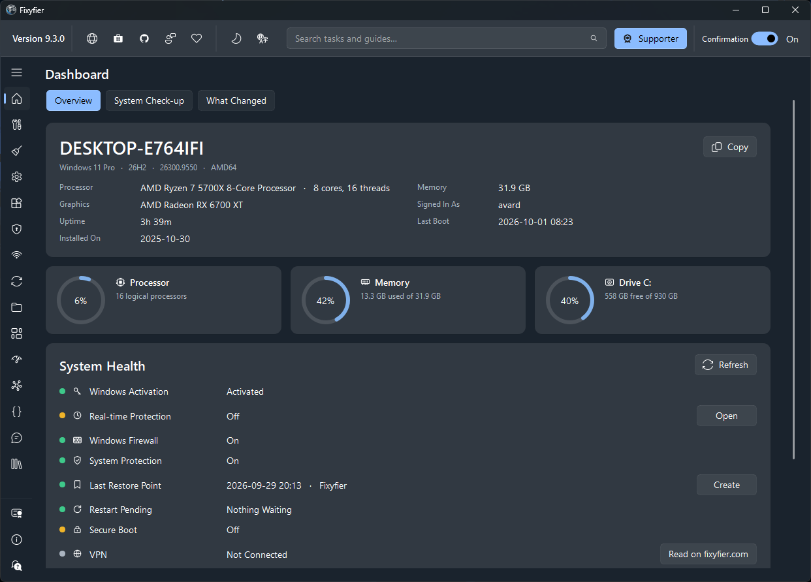
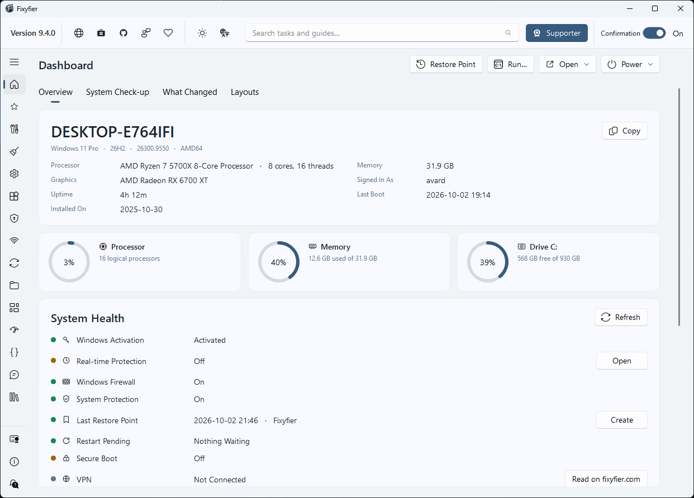

<p align="center">
  <a href="https://fixyfier.com">
    
  </a>
</p>

<h1 align="center">Fixyfier</h1>

<p align="center">
  <b>Technician-grade Windows repair &amp; maintenance — no bloat, no placebo tweaks, no noise.</b><br/>
  Every task is a documented Windows command, and you see it before it runs.
</p>

<div align="center">

  
  
  
  
  [](LICENSE)
  

</div>

<p align="center">
  <a href="https://apps.microsoft.com/detail/9pp0m68r9b04"><b>Microsoft Store</b></a> &nbsp;&middot;&nbsp;
  <a href="https://fixyfier.com"><b>Website</b></a> &nbsp;&middot;&nbsp;
  <a href="https://fixyfier.com/documentation/"><b>Documentation</b></a> &nbsp;&middot;&nbsp;
  <a href="https://fixyfier.com/troubleshooting/"><b>Guides</b></a> &nbsp;&middot;&nbsp;
  <a href="https://fixyfier.com/#support"><b>Support</b></a>
</p>

<p align="center">
  <picture>
    <source media="(prefers-color-scheme: dark)" srcset="assets/img/fixyfier-dark-mode-interface.png">
    
  </picture>
</p>

---

## Why Fixyfier

Most "optimization" tools are bloated, noisy, or full of tweaks that do nothing.
Fixyfier collects the repair tools Windows already ships with — DISM, SFC, CHKDSK, the
built-in troubleshooters, the network stack commands, the service and package managers
and dozens of buried settings — puts them one click away, and adds the answers Windows
keeps in its own records: why the PC is slow, what crashed, what changed, where the space went.

It is a convenience layer, not a magic fix. **Nothing happens that you could not do
yourself from an elevated terminal**, and you are shown the command line first.

<table>
<tr>
<td width="25%" align="center"><b>No ads</b></td>
<td width="25%" align="center"><b>No account</b></td>
<td width="25%" align="center"><b>No telemetry</b></td>
<td width="25%" align="center"><b>No analytics</b></td>
</tr>
</table>

Settings, routines and your change history live in `HKCU\SOFTWARE\Fixyfier`, on your PC only.
No log files are kept on disk. Nothing runs in the background once the app is closed, and Fixyfier goes online only when a
task needs it: app updates, the extra cleaning rules, network tests, guide links and the
Microsoft Store purchase check.

---

## What it does

Over **200 tasks, switches and answers** across **fifteen screens**, grouped by what you are trying to achieve.

<table>
<tr>
<td width="33%" valign="top">

### 🖥️ Dashboard
What the machine is, live gauges and a health card — plus a **34-check System Check-up**, **What Changed** in the last 30 days with Undo, and saved desktop icon and window **Layouts**. Restore Point, Run…, Open and Power are always one click away.

</td>
<td width="33%" valign="top">

### ⭐ Favorites &amp; Routines
Star any task to pin it, run the first nine with `Ctrl+1`–`Ctrl+9`, and chain tasks into named routines you run with one click — also from the notification area.

</td>
<td width="33%" valign="top">

### 🔧 Fix &amp; Repair
One Fix pass with seven steps, DISM, SFC, CHKDSK, the icon and search caches, Quick Machine Recovery, undoing other tools' damage, and every built-in troubleshooter.

</td>
</tr>
<tr>
<td valign="top">

### 🧹 Cleanup &amp; Optimize
Temp files, the Recycle Bin, thumbnail, Teams and Outlook caches, `Windows.old`, restore points, and community cleaning rules — with a dry run first.

</td>
<td valign="top">

### 🛠️ System Tools
Specifications and drive health, a PC report for a technician, power plans and battery, moving to a new PC, finding broken leftovers, Hyper-V and DirectPlay.

</td>
<td valign="top">

### 🪟 Windows Tools
**21** Windows utilities one click away — Event Viewer, Device Manager, Registry Editor, the Run box, Notification Settings (Do Not Disturb) and the rest.

</td>
</tr>
<tr>
<td valign="top">

### 🔒 Security &amp; Privacy
Defender scans, the firewall and Smart App Control, plus **50+** advertising, suggestion and diagnostic-data settings — each its own switch, or all off in one pass. When another antivirus or firewall is in charge, Fixyfier names it.

</td>
<td valign="top">

### 🌐 Network &amp; Connectivity
Your IP addresses, Wi-Fi details, sharing Wi-Fi with a QR code, ping, traceroute, open connections, DNS flush, and TCP/IP, Winsock and full stack resets.

</td>
<td valign="top">

### 🔄 Updates
Windows Update, app updates through winget, Defender definitions, the Microsoft Store, and the resets and troubleshooters for updates that will not install.

</td>
</tr>
<tr>
<td valign="top">

### 📁 Files &amp; Folders
Force-delete, unlock, lock, hide, repair permissions, get back an older version, check a file's fingerprint, and fix folders that point nowhere.

</td>
<td valign="top">

### 📦 Installed Apps
Every app in one list with sizes, multi-select uninstall, Reset and Repair, Startup Apps and programs' scheduled tasks A to Z, and a switch for each of **31** preinstalled apps.

</td>
<td valign="top">

### ⚙️ Processes &amp; Services
What is running, what it is and whether it is safe to end — and every Windows service with Windows' own description, with no way to disable what Windows needs to start.

</td>
</tr>
<tr>
<td valign="top">

### ❓ Answers
**51** questions answered from Windows' own records: why it is slow, what crashed, why it restarted, where the space went, what happened while you were away — and *I Think I Was Scammed*.

</td>
<td valign="top">

### 📜 Scripts &amp; MyTools
Generate a cleanup batch file, build your own, or run your `.bat`, `.cmd`, `.ps1` and `.vbs` files with the rights Fixyfier already has.

</td>
<td valign="top">

### 📚 Troubleshooting Guides
All **72** fixyfier.com guides browsable in the app, and a search that understands symptoms — type *no sound* and it finds the audio repair, as you type.

</td>
</tr>
</table>

---

## How it behaves

> These are the rules the app is built on, not marketing lines.

- **Every command is shown before it runs.** Advanced tasks print the exact command line.
- **There is always a way back.** An advanced task asks Windows for a restore point first, and Your Changes can undo what Fixyfier changed.
- **Unknown is a real answer.** Anything Fixyfier could not read says so, rather than showing green or zero.
- **Deletions preview first.** Cleanup tasks offer a dry run that lists what would go, without removing anything.
- **A long run can be stopped.** Output is live, and Stop ends the run rather than the current step.
- **What Windows needs stays put.** Core processes are never ended, and services Windows needs to start are never stopped or disabled.
- **Your files are yours.** Fixyfier never reads, changes or vouches for the scripts in your MyTools folder.

---

## Themes

Light and dark, switchable from the top bar, and the whole app follows.

<table>
  <tr>
    <td align="center">
      <br>
      <sub><b>Light Theme</b></sub>
    </td>
    <td align="center">
      <br>
      <sub><b>Dark Theme</b></sub>
    </td>
  </tr>
</table>

---

## Languages

Fixyfier ships in **44 languages**, switchable from the top bar and applied immediately.

<details>
<summary><b>See the full list</b></summary>

<br/>

Albanian &middot; Arabic &middot; Bengali &middot; Bulgarian &middot; Chinese (Simplified) &middot;
Chinese (Traditional) &middot; Croatian &middot; Czech &middot; Danish &middot; Dutch &middot;
English &middot; Estonian &middot; Filipino &middot; Finnish &middot; French &middot; German &middot;
Greek &middot; Hebrew &middot; Hindi &middot; Hungarian &middot; Indonesian &middot; Italian &middot;
Japanese &middot; Korean &middot; Latvian &middot; Lithuanian &middot; Norwegian &middot; Persian &middot;
Polish &middot; Portuguese (Brazil) &middot; Portuguese (Portugal) &middot; Romanian &middot; Russian &middot;
Serbian &middot; Slovak &middot; Slovenian &middot; Spanish &middot; Spanish (Latin America) &middot;
Swahili &middot; Swedish &middot; Thai &middot; Turkish &middot; Ukrainian &middot; Vietnamese

</details>

---

## Install

Get the signed, always-current build from the Microsoft Store.

<p>
  <a href="https://apps.microsoft.com/detail/9pp0m68r9b04?referrer=appbadge&amp;mode=direct&amp;cid=github_official" target="_blank">
    
  </a>
</p>

**WinGet**

```powershell
winget install --id 9pp0m68r9b04 --source msstore
```

Fixyfier runs as administrator, because most of what it does requires it.

---

## MyTools

Drop a `.bat`, `.cmd`, `.ps1` or `.vbs` file into `Documents\Fixyfier\MyTools` and it appears
as a card straight away — no restart, no right-click, no execution-policy detour. Fixyfier is
already elevated, so your script runs elevated.

The first **three runs are free**. After that it is a one-time unlock in the Microsoft Store:
no subscription, no tiers, and every other feature of Fixyfier works exactly the same either way.

---

<p align="center">
  <b>Fixyfier is free and maintained independently.</b><br/>
  If it saves you time, you can support it here:<br/><br/>
  ❤️ <a href="https://www.paypal.com/donate/?hosted_button_id=5ZA38NSJHMWHJ"><b>Support Fixyfier</b></a>
</p>

<p align="center">
  <sub><a href="https://fixyfier.com/documentation/">Documentation</a> &middot;
  <a href="https://fixyfier.com/troubleshooting/">Troubleshooting Guides</a> &middot;
  <a href="https://fixyfier.com">fixyfier.com</a></sub>
</p>
